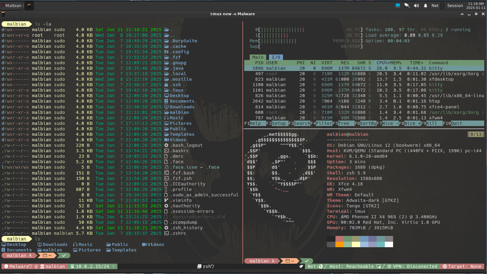
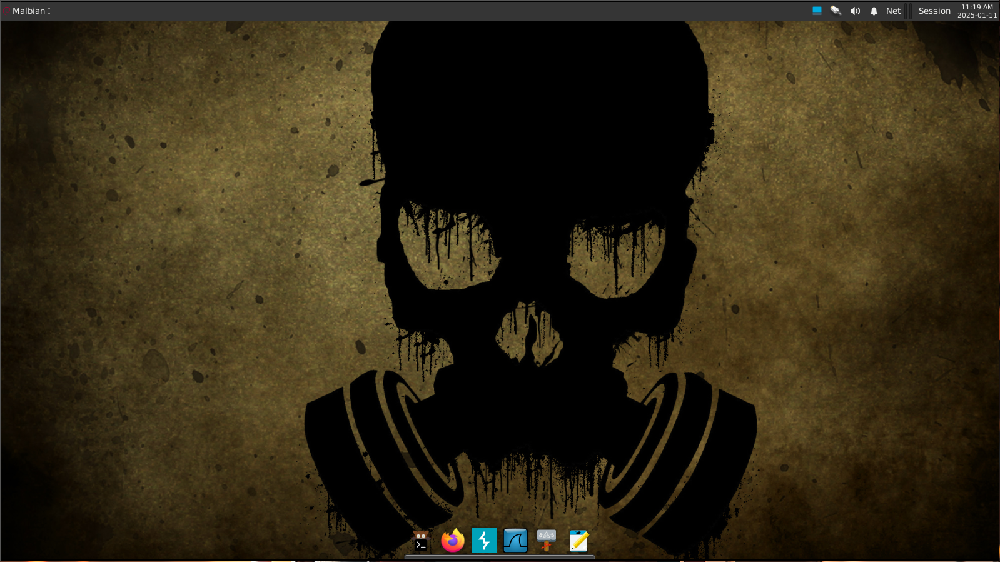
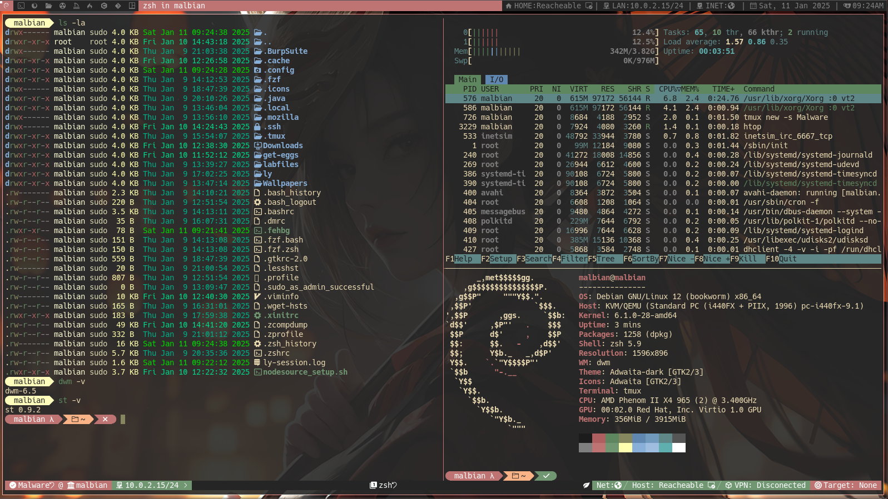

# Malbian-ISOs

[Malbian ISOs](https://sourceforge.net/projects/malbianlinux/files/images/) are released on SourceForge.

There is one ISO available for now. It is using XFCE as a desktop environment.

## Installation Guide:

Prepare the iso:
```shell
cd ~/Downloads
unzip -d malbian_xfce_alpha-bokken-v1-0_x86_64.iso.gz
```
Don't forget to check it's Hashes:

**malbian_xfce_alfa-release_x86_64.iso:**
- MD5: c9e4694de55ccc84b94e418331ceacbd 
- SHA1: 234d44c589a9082c51645793fea298a61f8882bb
- SHA256: bd970e8067ff42506ec53afa930c1c8a1ee4e0cf9570f84ee653a4cc784c9236 
- SHA384: 1c2c61a1a1e781544a212a2dd4bacb3c0fdcca0e624f1a9111c18df01314a9d2adcd333be4531d77fb073c56d06fedb8
- shA512: b2fe336527e3c460350723854dd72b378bbd4951a78d0d21e990d9a1dd36a53945d2560704cf8537f31493425567fd4206749c0f156e73065880f80a71557e2b

After verifying the ISO hashes you can now run them in a hypervisor. In our example we're gonna do the installation in qemu.

First, we need to place the ISO in a combinient place and then create an image:
```shell
cd /var/lib/libvirt/images
sudo mv ~/Downloads/malbian_xfce_alpha-bokken-v1-0_x86_64.iso
sudo qemu-img create -f qcow2 malbianImage.img 30G
```
Now that we have our image created we can simply boot it from the ISO:
```shell
sudo qemu-system-x86_64 -enable-kvm -cdrom /var/lib/libvirt/images/malbian_xfce_alf-release_x86_64.iso -boot menu=on -drive file=malbianImage.img -m 4G -cpu host -smp 2 -vga virtio -display sdl,gl=on
```

The credentials for the live session are **malbian:malbian**

If you wish to install Malbian OS then just open a terminal and run:
```shell
sudo calamares
```

Complete the instalation and now you can boot from disk running:
```shell
sudo qemu-system-x86_64 -enable-kvm -boot menu=on -drive file=testImage.img -m 4G -cpu host -smp 2 -vga virtio -display sdl,gl=on
```

With that we completed the installation of Malbian XFCE (Alpha - Bokken).

## Sample View

XFCE Desktop:

<p align="center"></p>
<p align="center"></p>

DWM Desktop:

<p align="center"></p>
<p align="center"></p>
