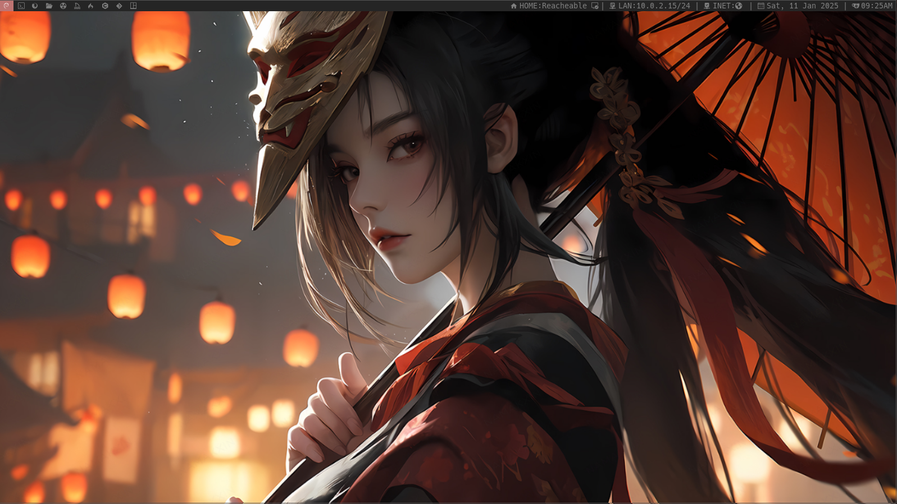

# Malbian-ISOs

[Malbian ISOs](https://sourceforge.net/projects/malbianlinux/files/images/) are released on SourceForge.

There is one ISO available for now. It is using XFCE as a desktop environment.

## Installation Guide:

Verify file Hashes:
```shell
md5sum malbian_xfce_alpha-bokken-v1-1_x86_64.iso.gz
sha1sum malbian_xfce_alpha-bokken-v1-1_x86_64.iso.gz
sha256sum malbian_xfce_alpha-bokken-v1-1_x86_64.iso.gz
```
**malbian_xfce_alpha-bokken-v1-1_x86_64.iso.gz:**
- MD5: 0af328bf27c06c3aff8068bc5d85551c 
- SHA1: 8e301106ba0f7d35e7d3a7ea58544c9c8f14d3a8
- SHA256: 83f05605908b90224860729f8e0d775c8da98d326473ca20e389689443544f8f 

**malbian_xfce_alpha-bokken-v1-0_x86_64.iso.gz:**
- MD5: c9e4694de55ccc84b94e418331ceacbd 
- SHA1: 234d44c589a9082c51645793fea298a61f8882bb
- SHA256: bd970e8067ff42506ec53afa930c1c8a1ee4e0cf9570f84ee653a4cc784c9236 

After verifying the ISO hashes we can unzip the the file and prepare the iso:
```shell
cd ~/Downloads
unzip -d malbian_xfce_alpha-bokken-v1-1_x86_64.iso.gz
```

After the ISO has been set, we need to chose a hypervisor to run it. In our example we're gonna do the installation in qemu. Place the ISO in a combinient place and then create an image:
```shell
cd /var/lib/libvirt/images
sudo mv ~/Downloads/malbian_xfce_alpha-bokken-v1-1_x86_64.iso .
sudo qemu-img create -f qcow2 malbianImage.img 30G
```
Now that we have our image created we can simply boot it from the ISO:
```shell
sudo qemu-system-x86_64 -enable-kvm -cdrom /var/lib/libvirt/images/malbian_xfce_alpha-bokken-v1-1_x86_64 -boot menu=on -drive file=malbianImage.img -m 4G -cpu host -smp 2 -vga virtio -display sdl,gl=on
```

The credentials for the live session are **malbian:malbian**

If you wish to install Malbian OS then just open a terminal and run:
```shell
sudo calamares
```

Complete the instalation and now you can boot from disk running:
```shell
sudo qemu-system-x86_64 -enable-kvm -boot menu=on -drive file=testImage.img -m 4G -cpu host -smp 2 -vga virtio -display sdl,gl=on
```

With that we completed the installation of Malbian XFCE (Alpha - Bokken).

## Sample View

XFCE Desktop:

<p align="center"></p>
<p align="center"></p>

DWM Desktop:

<p align="center"></p>
<p align="center"></p>
